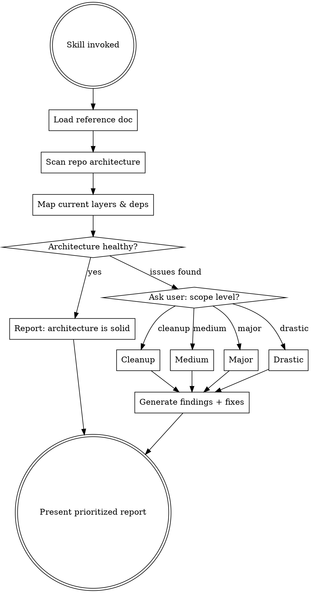

# Clean Architecture Audit & Refactor

Analyze a repository's architecture through the lens of Clean Architecture principles, then suggest concrete fixes at a user-chosen scope level.

## How This Skill Works



## Phase 1: Load Clean Architecture Reference

Read the reference document located in the same directory as this skill:
```
clean-architecture-reference.md
```

This contains all principles you need: Dependency Rule, 4 layers, SOLID at architecture scale, component cohesion (REP/CCP/CRP), component coupling (ADP/SDP/SAP), Screaming Architecture, boundaries, anti-patterns, and the practical checklist.

**Internalize these before scanning.** Every finding must map to a named principle.

**Important:** Not every codebase needs fixing. If the architecture is already well-structured, say so clearly instead of inventing problems. The goal is honest assessment, not a guaranteed list of complaints.

## Phase 2: Deep Architecture Scan

Use the Explore agent (subagent_type=Explore, thoroughness=very thorough) to analyze the target repo. Use the current working directory unless a different repo path is given.

**Scan checklist — the agent must map:**

| Area | What to find |
|------|-------------|
| **Directory structure** | Top-level dirs, does it scream domain or framework? |
| **Server layers** | API routes -> services -> DB. Are they clean or leaking? |
| **Client layers** | Pages -> components -> composables -> stores. Where's business logic? |
| **Dependency flow** | Do routes call DB directly? Is there an abstraction layer? |
| **Type sharing** | Where are types? Shared across layers properly? |
| **Feature boundaries** | Are features isolated or interleaved? |
| **God files** | Files >500 lines with mixed concerns |
| **Dead code** | Unused exports, unreachable branches, orphaned files |
| **Circular deps** | Services that call each other in cycles |
| **External API access** | Direct calls or through adapters/interfaces? |
| **Error handling** | Consistent patterns or scattered approaches? |

**For each issue found, tag it with the Clean Architecture principle it violates.**

## Phase 3: Assess Health & Ask User for Scope

### If the architecture is healthy

If the scan reveals a well-structured codebase with no significant violations — clean dependency flow, proper layer separation, no god files, consistent patterns — **say so honestly**. Present a health report:

> **Architecture Health: Good**
>
> The codebase follows clean architecture principles well. Dependencies flow inward, business logic lives in the right layers, boundaries are clear, and patterns are consistent.
>
> [List 2-3 specific strengths observed]
>
> Minor suggestions (if any): [only truly minor items, or "None — keep doing what you're doing."]

Do not invent problems to fill a report. A clean bill of health is a valid and valuable outcome. The user deserves to know their architecture is solid, not be handed busywork.

### If issues are found

Present the scan summary with a brief overview of what was found, then ask:

> **What level of changes do you want?**
>
> 1. **Cleanup** — Low risk, high confidence. No architecture changes.
>    - Remove dead code (unused exports, unreachable branches, orphaned files)
>    - Combine redundant implementations into single shared versions
>    - Fix inconsistent naming/patterns across similar code
>    - Remove duplicate type definitions
>    - Clean up unused imports and dependencies
>
> 2. **Medium** — Moderate risk, clear benefit. Moves logic to correct layers.
>    - Extract business logic from route handlers into dedicated services
>    - Move scattered validation into centralized service methods
>    - Break up god files (>500 lines) into focused, single-responsibility modules
>    - Standardize error handling patterns across the codebase
>    - Consolidate overlapping stores/state management
>    - Create missing abstractions for direct external API calls
>
> 3. **Major** — High impact, requires planning. Restructures toward Clean Architecture.
>    - Encapsulate use-case-specific logic into dedicated Use Case classes/functions
>    - Introduce interface-based adapters for all external dependencies (DB, LLM, external APIs)
>    - Restructure directories to scream domain instead of framework (Screaming Architecture)
>    - Establish explicit boundaries between feature domains
>    - Apply Dependency Inversion at all layer boundaries
>    - Create a proper "Main" component that wires concrete implementations to interfaces
>
> 4. **Drastic** — Full rethink. Considers technology replacement and parallel rewrite.
>    - Evaluate whether the current tech stack is fundamentally limiting the architecture
>    - Propose a target architecture with potentially different frameworks, languages, or infrastructure
>    - Design a parallel rewrite strategy: build the new system alongside the old one
>    - Plan incremental migration: identify which modules to migrate first (lowest coupling, highest pain)
>    - Define the strangler fig pattern — new features go to the new system, old features migrate over time
>    - Establish a compatibility layer / API gateway so both old and new coexist during transition
>    - Estimate effort and risk for the full migration path
>    - **Only recommend this when the existing stack has fundamental constraints** (e.g., framework is abandoned, language ecosystem is dying, performance ceiling is structural, or the codebase has grown beyond what incremental refactoring can fix)

Wait for the user's choice before generating the report.

## Phase 4: Generate Findings Report

Structure the report as:

```markdown
# Clean Architecture Audit — [Repo Name]

## Scope: [Cleanup | Medium | Major | Drastic]

## Executive Summary
[2-3 sentences: overall health, biggest issue, recommended priority]

## Findings

### Finding 1: [Short title]
- **Principle violated:** [Named principle from reference doc]
- **Where:** [Specific file paths and line ranges]
- **What's wrong:** [Concrete description with code snippets]
- **Fix:** [Specific, actionable fix with code example]
- **Risk:** [Low/Medium/High — what could break]
- **Effort:** [S/M/L]

### Finding 2: ...
[Repeat for each finding]

## Dependency Map
[ASCII diagram showing current dependency flow between major components]

## Priority Order
[Numbered list — which fixes to do first based on risk/effort/impact]
```

### Scope-Specific Focus

**Cleanup scope — focus on:**
- Dead code: grep for unused exports, check import counts
- Redundancy: find functions/utilities that do the same thing
- Inconsistency: naming patterns, error handling styles, response formats
- **Do NOT suggest moving code between layers or changing architecture**

**Medium scope — focus on:**
- Everything in Cleanup, PLUS:
- Business logic in wrong layer (routes doing business logic -> move to services)
- God files that need splitting (identify clear split boundaries)
- Missing service abstractions (direct DB calls in handlers)
- Inconsistent patterns that should be unified (error handling, validation)
- **Map each fix to: SRP, CCP, or ISP principle**

**Major scope — focus on:**
- Everything in Medium, PLUS:
- Use Case encapsulation (identify distinct use cases, propose class/function boundaries)
- Adapter pattern for externals (define interfaces, show concrete impls)
- Screaming Architecture restructure (propose new directory layout)
- Boundary definitions (where to draw lines, what crosses them)
- Dependency Inversion opportunities (where control flow opposes desired dependency direction)
- **Map each fix to: Dependency Rule, DIP, ADP, SDP, SAP, Screaming Architecture**

**Drastic scope — focus on:**
- Everything in Major as the baseline assessment, PLUS:
- **Tech stack evaluation:** Is the current framework/language/infrastructure fundamentally constraining the architecture? Be specific — "Nuxt SSR limitations force X" not just "consider alternatives"
- **Target architecture design:** Propose a concrete target stack with rationale. Why this stack? What Clean Architecture problems does it solve that refactoring can't?
- **Strangler fig migration plan:** Don't suggest a big-bang rewrite. Design an incremental migration:
  1. Identify the module with the worst architecture AND lowest coupling — migrate that first
  2. Define an API gateway or compatibility layer so old and new systems coexist
  3. New features go to the new system; old features migrate in priority order
  4. Each migration step must leave the system fully functional
- **Effort and risk matrix:** For each migration phase, estimate effort (weeks/months) and risk (what breaks if it goes wrong)
- **Decision criteria:** Be explicit about when Drastic is warranted vs. when Major would suffice. Drastic is for: abandoned frameworks, structural performance ceilings, ecosystem dead-ends, or when cumulative tech debt makes incremental refactoring more expensive than replacement
- **When NOT to recommend Drastic:** If the problems are solvable with Major-level refactoring, say so. A parallel rewrite is enormously expensive — only recommend it when you genuinely believe incremental changes can't get there
- **Map each fix to: all principles from Major, plus Plugin Architecture (swappability), Boundaries (migration seams), Main Component (rewiring)**

## Important Rules

1. **Every finding must cite a specific Clean Architecture principle.** No vague "this could be better."
2. **Every fix must include concrete file paths and code.** No hand-wavy suggestions.
3. **Respect the chosen scope.** Don't suggest Major changes when user chose Cleanup.
4. **Prioritize by risk/effort ratio.** Low-risk, high-impact first.
5. **Flag breaking changes explicitly.** If a fix could break existing functionality, say so with the specific risk.
6. **Don't over-abstract.** Three similar lines of code is better than a premature abstraction. Only suggest abstractions when there are 3+ concrete instances that would benefit.
7. **Consider framework conventions.** Some "violations" are framework conventions (e.g., auto-imported composables, file-based routing). Don't fight the framework where it provides genuine value — flag where framework conventions hurt architecture.

## Quick Reference: Principle -> Symptom

| Symptom | Likely Principle Violated |
|---------|--------------------------|
| Business logic in route handler | SRP, Dependency Rule |
| Route handler calls DB directly | Dependency Rule, missing adapter |
| File >500 lines with mixed concerns | SRP, CCP |
| Same logic in 3+ places | DRY (extract, apply CCP) |
| Circular imports between services | ADP |
| Concrete external API calls with no interface | DIP, Plugin Architecture |
| Directory named by tech not domain | Screaming Architecture |
| DTO/DB entity used as domain model | Dependency Rule (data crossing boundaries) |
| Tests require full framework to run | Test Boundary violation |
| Changing one feature breaks another | Missing boundary, CCP violation |
| Unused exports, dead functions | Component hygiene (CRP) |
| Inconsistent error handling | Missing adapter pattern |
| Framework workarounds everywhere | Consider Drastic — framework may be the constraint |
| Performance ceiling despite optimization | Structural limitation — evaluate stack replacement |
| Can't add features without touching 10+ files | Missing boundaries, possibly beyond Major-level fix |
